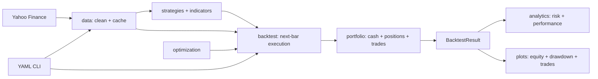

# Argmax

Argmax is a typed, modular Python framework for researching long-only systematic
strategies. It combines cached Yahoo Finance data, vectorized indicators, a next-bar
backtest engine, transaction-aware portfolio accounting, performance analytics,
optimization, plots, and a YAML-driven CLI.

> Argmax is educational research software, not investment advice or a live-trading
> system. Backtests do not guarantee future results.

## Highlights

- Bias-aware execution: a signal observed at today's close executes at the next open
- Realistic accounting: integer shares, proportional commissions, adverse slippage,
  partial capital allocation, and optional final liquidation
- Extensible strategies: subclass one small abstract interface
- Reproducible research: parameter ranking and deterministic random search
- Clean outputs: immutable result objects containing account history, trades, signals,
  source data, and risk metrics

## Installation

Argmax requires Python 3.12 or newer.

```bash
python -m venv .venv
source .venv/bin/activate
pip install -e ".[dev]"
pytest
```

## Quick start

```python
from argmax.backtest import Backtest
from argmax.data import get_data
from argmax.plots import plot_equity, plot_trades
from argmax.strategies import MovingAverageCross

data = get_data("SPY", start="2015-01-01", end="2025-01-01")
strategy = MovingAverageCross(fast=20, slow=100)
result = Backtest(
    strategy=strategy,
    data=data,
    capital=100_000,
    commission=0.001,
    slippage=0.0005,
).run()

print(result.summary())
print(f"Sharpe: {result.sharpe_ratio:.2f}")
plot_equity(result)
plot_trades(result)
```

For several symbols, `get_data(["SPY", "QQQ"], ...)` returns a DataFrame with
`(Ticker, Field)` column levels. Backtests intentionally accept one asset at a time;
select a ticker with `data["SPY"]`.

## Custom strategies

Strategies return a target-exposure Series: `1` for invested and `0` for cash.
Argmax validates and shifts it one bar before execution.

```python
import pandas as pd

from argmax.indicators import EMA
from argmax.strategies import Strategy

class TrendStrategy(Strategy):
    def generate_signals(self, data: pd.DataFrame) -> pd.Series:
        close = data["Close"]
        return (close > EMA(close, period=50)).astype(float)
```

Built-ins include `MovingAverageCross`, `RSIMeanReversion`, `BollingerReversion`,
and `MomentumStrategy`.

## Indicators

```python
from argmax.indicators import ATR, EMA, MACD, RSI, SMA, BollingerBands

rsi = RSI(data["Close"], period=14)
macd, signal, histogram = MACD(data["Close"])
middle, upper, lower = BollingerBands(data["Close"])
atr = ATR(data, period=14)
```

Each output component is a pandas Series aligned to the input index. Warm-up periods
are represented by `NaN`, which prevents premature signals.

## Optimization

```python
from argmax.optimization import GridSearch
from argmax.strategies import MovingAverageCross

optimizer = GridSearch(
    strategy_class=MovingAverageCross,
    param_grid={"fast": [10, 20, 30], "slow": [50, 100, 200]},
)
ranking = optimizer.run(data, capital=100_000, commission=0.001)
print(optimizer.best_params)
print(ranking.head())
```

`RandomSearch` accepts the same grid plus `n_iter` and `random_state`. Optimizing on
one historical sample can overfit; use a held-out or walk-forward evaluation before
drawing conclusions.

## CLI

Copy `examples/config.yaml`, then run:

```bash
argmax backtest examples/config.yaml
```

The CLI downloads data, constructs the selected built-in strategy, runs the backtest,
prints metrics, and optionally writes JSON metrics and an equity chart.

## Web dashboard

Argmax includes a responsive, dependency-free browser dashboard with strategy controls,
performance cards, interactive equity/drawdown/price charts, and a realized-trade ledger.

```bash
argmax serve
```

Open [http://127.0.0.1:8000](http://127.0.0.1:8000) for the product landing page, or
[http://127.0.0.1:8000/app.html](http://127.0.0.1:8000/app.html) to enter the research
console directly. The dashboard uses the same tested Python engine as the package and CLI.

## Publish with GitHub and Vercel

The repository includes `public/` static assets, a Python function at `api/backtest.py`,
and `vercel.json`. No frontend build command or environment variables are required.

1. Create an empty repository named `argmax` on GitHub. Do not add a README, license,
   or `.gitignore` because this project already contains them.
2. Publish this directory:

   ```bash
   git init
   git add .
   git commit -m "Initial Argmax release"
   git branch -M main
   git remote add origin https://github.com/YOUR_USERNAME/argmax.git
   git push -u origin main
   ```

3. In Vercel, choose **Add New > Project**, import the GitHub repository, keep the default
   project settings, and select **Deploy**.
4. Every later push to `main` updates production; pull requests receive preview deployments.

The hosted API downloads Yahoo Finance data per request because serverless filesystems are
ephemeral. For a high-traffic production service, replace this with a persistent market-data
store and add request-level rate limiting.

## Metrics

| Metric | Definition |
|---|---|
| Total return | Ending equity divided by starting equity, minus one |
| Annualized return | Geometrically annualized total return using 252 sessions |
| Volatility | Annualized standard deviation of daily returns |
| Sharpe ratio | Annualized excess mean return divided by standard deviation |
| Sortino ratio | Annualized excess mean return divided by downside deviation |
| Max drawdown | Largest peak-to-trough equity decline |
| Win rate | Fraction of completed trades with positive net P&L |
| Profit factor | Gross realized profit divided by gross realized loss |

Ratios return `0` when they are undefined because variability is absent. Profit factor
is infinite when profitable trades exist without a losing trade.

## Architecture



See [the architecture notes](docs/architecture.md) and [API examples](docs/api_examples.md)
for extension points and accounting conventions.

## Development

```bash
ruff check .
ruff format --check .
pytest --cov=argmax --cov-report=term-missing
```

The project uses a `src/` package layout, Ruff, pytest, type hints, dataclasses, and CI.
Contributions should include tests for behavior changes.

## License

MIT
